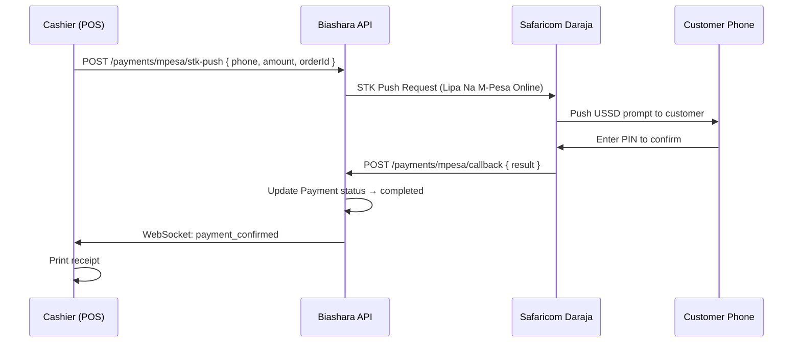
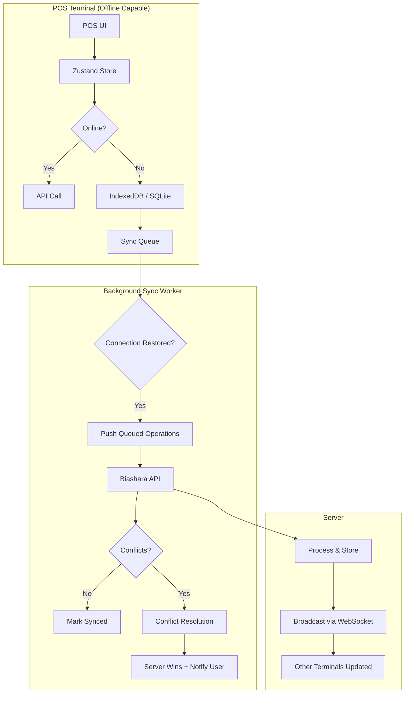
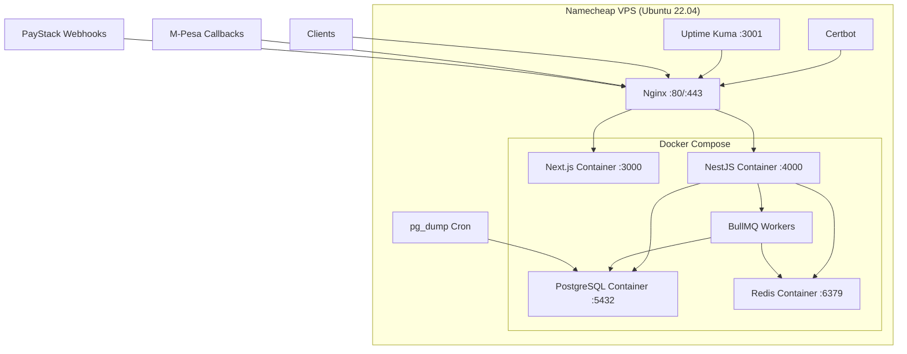
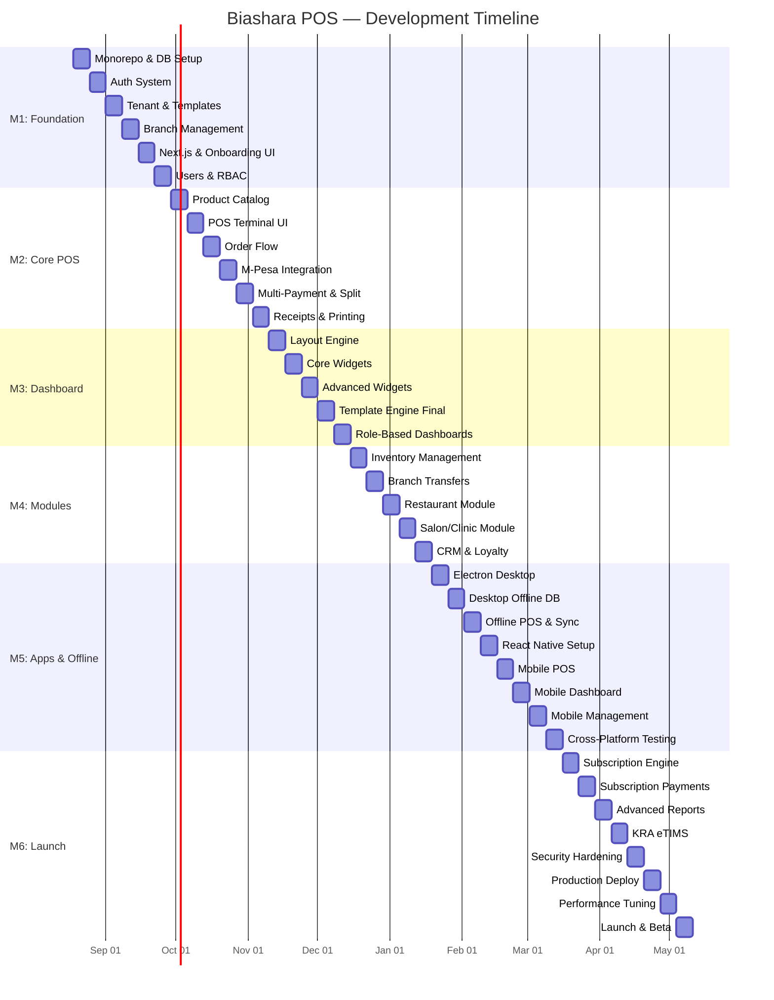

# Biashara POS — Final Implementation Plan

> **Biashara** (Swahili for "Business") — A fully customizable, multi-tenant POS platform built for Kenya and beyond.

---

## Decisions Locked In

| Decision | Choice |
|----------|--------|
| **Target Market** | Kenya 🇰🇪 (KES, M-Pesa, KRA eTIMS) |
| **Backend** | NestJS (Node.js + TypeScript) |
| **Frontend** | Next.js 14+ (App Router, TypeScript) |
| **Desktop App** | Electron (wrapping Next.js) |
| **Mobile App** | React Native (Expo) |
| **Database** | PostgreSQL 16 (Shared DB, `tenant_id` isolation) |
| **ORM** | Prisma |
| **Hosting** | Namecheap VPS (Docker Compose + Nginx) |
| **Offline Mode** | Phase 1 — IndexedDB + background sync |
| **Multi-Tenancy** | Shared DB, row-level `tenant_id` filtering |
| **Subscription** | Free tier + Paid plans (monthly/yearly) |
| **Template Engine** | Full from day one |

---

## Tech Stack — Complete Breakdown

### Backend (NestJS)

| Layer | Package | Purpose |
|-------|---------|---------|
| **Framework** | `@nestjs/core` | Modular, injectable API framework |
| **ORM** | `prisma` + `@prisma/client` | Type-safe DB access with migrations |
| **Auth** | `@nestjs/passport` + `passport-jwt` | JWT access + refresh tokens |
| **Validation** | `class-validator` + `class-transformer` | DTO validation |
| **Queue** | `@nestjs/bullmq` + `bullmq` | Background jobs (receipts, reports, sync) |
| **Cache** | `@nestjs/cache-manager` + `redis` | Session cache, rate limiting |
| **WebSockets** | `@nestjs/websockets` + `socket.io` | Real-time: KDS, live dashboard, notifications |
| **File Upload** | `@nestjs/platform-express` + `multer` | Product images, logos |
| **Email** | `@nestjs-modules/mailer` + `nodemailer` | Transactional emails |
| **SMS** | `africastalking` | SMS notifications (Kenya) |
| **Payments** | `mpesa-node` (Daraja API) | M-Pesa STK Push, C2B, B2C |
| **Payments** | `paystack` | Card payments |
| **PDF** | `@react-pdf/renderer` or `puppeteer` | Receipt & report generation |
| **Scheduler** | `@nestjs/schedule` | Cron jobs: daily reports, subscription checks |
| **Logging** | `winston` + `nest-winston` | Structured logging |
| **Testing** | `jest` + `supertest` | Unit + E2E tests |

### Frontend (Next.js 14+)

| Layer | Package | Purpose |
|-------|---------|---------|
| **Framework** | `next@14` | App Router, SSR, API routes for BFF |
| **UI Components** | `shadcn/ui` + `radix-ui` | Accessible, customizable components |
| **Styling** | `tailwindcss` | Utility-first CSS (required by shadcn) |
| **State** | `zustand` | Lightweight global state |
| **Server State** | `@tanstack/react-query` | API caching, mutations, optimistic updates |
| **Forms** | `react-hook-form` + `zod` | Form validation |
| **Charts** | `recharts` | Dashboard visualizations |
| **Drag & Drop** | `@dnd-kit/core` | Dashboard widget builder |
| **Grid Layout** | `react-grid-layout` | Resizable dashboard widgets |
| **Tables** | `@tanstack/react-table` | Data tables with sorting, filtering |
| **Icons** | `lucide-react` | Consistent icon set |
| **Date** | `date-fns` | Date formatting & manipulation |
| **Offline** | `idb` (IndexedDB wrapper) | Offline data storage |
| **PWA** | `next-pwa` | Service worker for offline support |
| **Printing** | `escpos` / Web USB API | Thermal receipt printing |

### Desktop (Electron)

| Layer | Package | Purpose |
|-------|---------|---------|
| **Shell** | `electron` + `electron-builder` | Desktop wrapper |
| **IPC** | `electron-store` | Local settings persistence |
| **Auto-Update** | `electron-updater` | OTA updates |
| **Printing** | `node-thermal-printer` | Direct ESC/POS thermal printing |
| **SQLite** | `better-sqlite3` | Local offline database |
| **Build** | `electron-builder` | Cross-platform packaging (Windows, macOS, Linux) |

### Mobile (React Native + Expo)

| Layer | Package | Purpose |
|-------|---------|---------|
| **Framework** | `expo` (managed workflow) | Cross-platform mobile |
| **Navigation** | `expo-router` | File-based routing |
| **UI** | `react-native-paper` or `tamagui` | Material Design components |
| **State** | `zustand` | Shared with web |
| **Offline** | `@op-engineering/op-sqlite` | Mobile SQLite |
| **Camera** | `expo-camera` | Barcode scanning |
| **Printing** | `react-native-ble-manager` | Bluetooth thermal printers |
| **Push** | `expo-notifications` | Push notifications |

### Infrastructure (Namecheap VPS)

| Layer | Tool | Purpose |
|-------|------|---------|
| **Containerization** | `docker` + `docker-compose` | All services containerized |
| **Reverse Proxy** | `nginx` | SSL termination, load balancing |
| **SSL** | `certbot` (Let's Encrypt) | Free HTTPS |
| **Process Manager** | Docker restart policies | Auto-restart on crash |
| **Backups** | `pg_dump` + cron | Nightly DB backups |
| **Monitoring** | `uptime-kuma` | Self-hosted uptime monitoring |
| **Log Management** | Docker logs + `loki` (optional) | Centralized logging |

---

## Monorepo Structure

```
biashara-pos/
├── package.json                    # Root workspace config
├── turbo.json                      # Turborepo pipeline config
├── docker-compose.yml              # Development services
├── docker-compose.prod.yml         # Production deployment
├── nginx/
│   └── nginx.conf                  # Reverse proxy config
│
├── packages/
│   ├── shared/                     # Shared TypeScript types & utilities
│   │   ├── src/
│   │   │   ├── types/              # Shared interfaces & DTOs
│   │   │   │   ├── tenant.ts
│   │   │   │   ├── branch.ts
│   │   │   │   ├── product.ts
│   │   │   │   ├── order.ts
│   │   │   │   ├── payment.ts
│   │   │   │   └── index.ts
│   │   │   ├── constants/          # Business type templates, enums
│   │   │   │   ├── business-types.ts
│   │   │   │   ├── payment-methods.ts
│   │   │   │   ├── currencies.ts
│   │   │   │   └── permissions.ts
│   │   │   ├── utils/              # Shared utility functions
│   │   │   │   ├── currency.ts
│   │   │   │   ├── tax.ts
│   │   │   │   └── validation.ts
│   │   │   └── index.ts
│   │   ├── package.json
│   │   └── tsconfig.json
│   │
│   ├── db/                         # Prisma schema & migrations
│   │   ├── prisma/
│   │   │   ├── schema.prisma
│   │   │   ├── migrations/
│   │   │   └── seed.ts             # Seed data (business templates, demo)
│   │   ├── package.json
│   │   └── tsconfig.json
│   │
│   └── ui/                         # Shared React component library
│       ├── src/
│       │   ├── components/         # shadcn/ui based components
│       │   ├── hooks/              # Shared React hooks
│       │   └── index.ts
│       ├── package.json
│       └── tsconfig.json
│
├── apps/
│   ├── api/                        # NestJS Backend
│   │   ├── src/
│   │   │   ├── main.ts
│   │   │   ├── app.module.ts
│   │   │   ├── common/
│   │   │   │   ├── guards/
│   │   │   │   │   ├── jwt-auth.guard.ts
│   │   │   │   │   ├── roles.guard.ts
│   │   │   │   │   └── tenant.guard.ts
│   │   │   │   ├── interceptors/
│   │   │   │   │   ├── tenant.interceptor.ts
│   │   │   │   │   └── audit-log.interceptor.ts
│   │   │   │   ├── decorators/
│   │   │   │   │   ├── current-tenant.decorator.ts
│   │   │   │   │   ├── current-user.decorator.ts
│   │   │   │   │   └── roles.decorator.ts
│   │   │   │   ├── filters/
│   │   │   │   │   └── global-exception.filter.ts
│   │   │   │   └── middleware/
│   │   │   │       └── tenant-context.middleware.ts
│   │   │   │
│   │   │   ├── modules/
│   │   │   │   ├── auth/           # Authentication & authorization
│   │   │   │   │   ├── auth.module.ts
│   │   │   │   │   ├── auth.controller.ts
│   │   │   │   │   ├── auth.service.ts
│   │   │   │   │   ├── strategies/
│   │   │   │   │   │   ├── jwt.strategy.ts
│   │   │   │   │   │   └── refresh-jwt.strategy.ts
│   │   │   │   │   └── dto/
│   │   │   │   │       ├── register.dto.ts
│   │   │   │   │       └── login.dto.ts
│   │   │   │   │
│   │   │   │   ├── tenant/         # Tenant (business) management
│   │   │   │   │   ├── tenant.module.ts
│   │   │   │   │   ├── tenant.controller.ts
│   │   │   │   │   ├── tenant.service.ts
│   │   │   │   │   └── dto/
│   │   │   │   │
│   │   │   │   ├── branch/         # Branch management
│   │   │   │   │   ├── branch.module.ts
│   │   │   │   │   ├── branch.controller.ts
│   │   │   │   │   ├── branch.service.ts
│   │   │   │   │   └── dto/
│   │   │   │   │
│   │   │   │   ├── product/        # Product catalog
│   │   │   │   │   ├── product.module.ts
│   │   │   │   │   ├── product.controller.ts
│   │   │   │   │   ├── product.service.ts
│   │   │   │   │   └── dto/
│   │   │   │   │
│   │   │   │   ├── order/          # Order management
│   │   │   │   │   ├── order.module.ts
│   │   │   │   │   ├── order.controller.ts
│   │   │   │   │   ├── order.service.ts
│   │   │   │   │   └── dto/
│   │   │   │   │
│   │   │   │   ├── payment/        # Payment processing
│   │   │   │   │   ├── payment.module.ts
│   │   │   │   │   ├── payment.controller.ts
│   │   │   │   │   ├── payment.service.ts
│   │   │   │   │   ├── gateways/
│   │   │   │   │   │   ├── mpesa.gateway.ts      # M-Pesa Daraja API
│   │   │   │   │   │   ├── paystack.gateway.ts    # Card payments
│   │   │   │   │   │   ├── cash.gateway.ts        # Cash handling
│   │   │   │   │   │   └── gateway.interface.ts   # Common interface
│   │   │   │   │   ├── webhooks/
│   │   │   │   │   │   ├── mpesa.webhook.ts
│   │   │   │   │   │   └── paystack.webhook.ts
│   │   │   │   │   └── dto/
│   │   │   │   │
│   │   │   │   ├── inventory/      # Stock management
│   │   │   │   │   ├── inventory.module.ts
│   │   │   │   │   ├── inventory.controller.ts
│   │   │   │   │   ├── inventory.service.ts
│   │   │   │   │   └── dto/
│   │   │   │   │
│   │   │   │   ├── customer/       # CRM & loyalty
│   │   │   │   │   ├── customer.module.ts
│   │   │   │   │   ├── customer.controller.ts
│   │   │   │   │   ├── customer.service.ts
│   │   │   │   │   └── dto/
│   │   │   │   │
│   │   │   │   ├── dashboard/      # Dashboard config & widgets
│   │   │   │   │   ├── dashboard.module.ts
│   │   │   │   │   ├── dashboard.controller.ts
│   │   │   │   │   ├── dashboard.service.ts
│   │   │   │   │   ├── widgets/
│   │   │   │   │   │   ├── widget.registry.ts
│   │   │   │   │   │   ├── sales-widget.ts
│   │   │   │   │   │   ├── inventory-widget.ts
│   │   │   │   │   │   └── custom-widget.ts
│   │   │   │   │   └── dto/
│   │   │   │   │
│   │   │   │   ├── template/       # Business type templates
│   │   │   │   │   ├── template.module.ts
│   │   │   │   │   ├── template.service.ts
│   │   │   │   │   ├── templates/
│   │   │   │   │   │   ├── retail.template.ts
│   │   │   │   │   │   ├── restaurant.template.ts
│   │   │   │   │   │   ├── salon.template.ts
│   │   │   │   │   │   ├── clinic.template.ts
│   │   │   │   │   │   ├── pharmacy.template.ts
│   │   │   │   │   │   └── generic.template.ts
│   │   │   │   │   └── dto/
│   │   │   │   │
│   │   │   │   ├── report/         # Analytics & reporting
│   │   │   │   │   ├── report.module.ts
│   │   │   │   │   ├── report.controller.ts
│   │   │   │   │   ├── report.service.ts
│   │   │   │   │   └── dto/
│   │   │   │   │
│   │   │   │   ├── subscription/   # SaaS billing
│   │   │   │   │   ├── subscription.module.ts
│   │   │   │   │   ├── subscription.controller.ts
│   │   │   │   │   ├── subscription.service.ts
│   │   │   │   │   └── dto/
│   │   │   │   │
│   │   │   │   ├── notification/   # Email, SMS, push
│   │   │   │   │   ├── notification.module.ts
│   │   │   │   │   ├── notification.service.ts
│   │   │   │   │   └── channels/
│   │   │   │   │       ├── email.channel.ts
│   │   │   │   │       ├── sms.channel.ts      # Africa's Talking
│   │   │   │   │       └── push.channel.ts
│   │   │   │   │
│   │   │   │   ├── sync/           # Offline sync engine
│   │   │   │   │   ├── sync.module.ts
│   │   │   │   │   ├── sync.gateway.ts         # WebSocket sync
│   │   │   │   │   ├── sync.service.ts
│   │   │   │   │   └── conflict-resolver.ts
│   │   │   │   │
│   │   │   │   ├── table-mgmt/     # Restaurant tables module
│   │   │   │   ├── appointment/    # Salon/clinic bookings
│   │   │   │   ├── kds/            # Kitchen display system
│   │   │   │   └── etims/          # KRA eTIMS integration
│   │   │   │
│   │   │   └── config/
│   │   │       ├── database.config.ts
│   │   │       ├── redis.config.ts
│   │   │       ├── mpesa.config.ts
│   │   │       └── app.config.ts
│   │   │
│   │   ├── Dockerfile
│   │   ├── package.json
│   │   ├── tsconfig.json
│   │   └── nest-cli.json
│   │
│   ├── web/                        # Next.js Web Dashboard + POS UI
│   │   ├── src/
│   │   │   ├── app/
│   │   │   │   ├── (auth)/                     # Auth pages (no sidebar)
│   │   │   │   │   ├── login/page.tsx
│   │   │   │   │   ├── register/page.tsx
│   │   │   │   │   └── onboarding/
│   │   │   │   │       ├── business-type/page.tsx
│   │   │   │   │       ├── business-details/page.tsx
│   │   │   │   │       ├── first-branch/page.tsx
│   │   │   │   │       └── setup-complete/page.tsx
│   │   │   │   │
│   │   │   │   ├── (dashboard)/                # Dashboard layout
│   │   │   │   │   ├── layout.tsx              # Sidebar + topbar
│   │   │   │   │   ├── page.tsx                # Main dashboard (widgets)
│   │   │   │   │   ├── pos/                    # POS terminal view
│   │   │   │   │   │   └── page.tsx
│   │   │   │   │   ├── products/
│   │   │   │   │   │   ├── page.tsx
│   │   │   │   │   │   └── [id]/page.tsx
│   │   │   │   │   ├── orders/
│   │   │   │   │   │   ├── page.tsx
│   │   │   │   │   │   └── [id]/page.tsx
│   │   │   │   │   ├── inventory/
│   │   │   │   │   │   └── page.tsx
│   │   │   │   │   ├── customers/
│   │   │   │   │   │   └── page.tsx
│   │   │   │   │   ├── branches/
│   │   │   │   │   │   ├── page.tsx
│   │   │   │   │   │   └── [id]/
│   │   │   │   │   │       ├── page.tsx
│   │   │   │   │   │       ├── settings/page.tsx
│   │   │   │   │   │       └── payments/page.tsx
│   │   │   │   │   ├── reports/
│   │   │   │   │   │   └── page.tsx
│   │   │   │   │   ├── settings/
│   │   │   │   │   │   ├── page.tsx
│   │   │   │   │   │   ├── business/page.tsx
│   │   │   │   │   │   ├── payments/page.tsx
│   │   │   │   │   │   ├── staff/page.tsx
│   │   │   │   │   │   ├── modules/page.tsx
│   │   │   │   │   │   └── subscription/page.tsx
│   │   │   │   │   └── kds/                    # Kitchen Display
│   │   │   │   │       └── page.tsx
│   │   │   │   │
│   │   │   │   ├── layout.tsx
│   │   │   │   └── globals.css
│   │   │   │
│   │   │   ├── components/
│   │   │   │   ├── dashboard/
│   │   │   │   │   ├── widget-grid.tsx
│   │   │   │   │   ├── widget-card.tsx
│   │   │   │   │   ├── widget-picker.tsx
│   │   │   │   │   └── widgets/
│   │   │   │   │       ├── sales-today.tsx
│   │   │   │   │       ├── revenue-chart.tsx
│   │   │   │   │       ├── top-products.tsx
│   │   │   │   │       ├── low-stock.tsx
│   │   │   │   │       ├── recent-orders.tsx
│   │   │   │   │       └── branch-comparison.tsx
│   │   │   │   ├── pos/
│   │   │   │   │   ├── product-grid.tsx
│   │   │   │   │   ├── cart-panel.tsx
│   │   │   │   │   ├── payment-modal.tsx
│   │   │   │   │   ├── receipt-view.tsx
│   │   │   │   │   └── barcode-scanner.tsx
│   │   │   │   ├── layout/
│   │   │   │   │   ├── sidebar.tsx
│   │   │   │   │   ├── topbar.tsx
│   │   │   │   │   └── branch-switcher.tsx
│   │   │   │   └── shared/
│   │   │   │       ├── data-table.tsx
│   │   │   │       ├── file-upload.tsx
│   │   │   │       └── currency-input.tsx
│   │   │   │
│   │   │   ├── lib/
│   │   │   │   ├── api-client.ts               # Axios/fetch wrapper
│   │   │   │   ├── auth.ts                     # Auth utilities
│   │   │   │   └── offline-db.ts               # IndexedDB manager
│   │   │   │
│   │   │   ├── stores/
│   │   │   │   ├── auth-store.ts
│   │   │   │   ├── cart-store.ts
│   │   │   │   ├── branch-store.ts
│   │   │   │   └── dashboard-store.ts
│   │   │   │
│   │   │   └── hooks/
│   │   │       ├── use-products.ts
│   │   │       ├── use-orders.ts
│   │   │       ├── use-branch.ts
│   │   │       └── use-offline-sync.ts
│   │   │
│   │   ├── public/
│   │   │   └── icons/
│   │   ├── Dockerfile
│   │   ├── next.config.js
│   │   ├── tailwind.config.ts
│   │   ├── package.json
│   │   └── tsconfig.json
│   │
│   ├── desktop/                    # Electron wrapper
│   │   ├── src/
│   │   │   ├── main.ts             # Electron main process
│   │   │   ├── preload.ts          # Preload scripts
│   │   │   ├── printing.ts         # ESC/POS thermal printing
│   │   │   ├── local-db.ts         # SQLite for offline
│   │   │   └── auto-update.ts      # Update mechanism
│   │   ├── package.json
│   │   └── electron-builder.yml
│   │
│   └── mobile/                     # React Native (Expo)
│       ├── app/
│       │   ├── (auth)/
│       │   │   ├── login.tsx
│       │   │   └── register.tsx
│       │   ├── (tabs)/
│       │   │   ├── dashboard.tsx
│       │   │   ├── pos.tsx
│       │   │   ├── orders.tsx
│       │   │   ├── products.tsx
│       │   │   └── settings.tsx
│       │   └── _layout.tsx
│       ├── components/
│       ├── stores/                  # Shared zustand stores
│       ├── lib/
│       ├── app.json
│       ├── package.json
│       └── tsconfig.json
│
├── .github/
│   └── workflows/
│       ├── api-ci.yml
│       ├── web-ci.yml
│       └── deploy.yml
│
├── .env.example
├── .gitignore
├── README.md
└── tsconfig.base.json
```

---

## Database Schema (Prisma)

### Core Tables

```prisma
// packages/db/prisma/schema.prisma

generator client {
  provider = "prisma-client-js"
}

datasource db {
  provider = "postgresql"
  url      = env("DATABASE_URL")
}

// ─────────────────────────────────────────────
// MULTI-TENANCY
// ─────────────────────────────────────────────

model Tenant {
  id              String    @id @default(uuid())
  name            String
  slug            String    @unique
  businessType    String    // retail, restaurant, salon, clinic, pharmacy, custom
  logo            String?
  email           String
  phone           String
  country         String    @default("KE")
  currency        String    @default("KES")
  timezone        String    @default("Africa/Nairobi")
  settings        Json      @default("{}")   // Business-specific settings
  dashboardConfig Json      @default("{}")   // Widget layout
  enabledModules  String[]  // ["pos", "inventory", "tables", "kds", "appointments"]
  customFields    Json      @default("{}") // Schema for tenant-defined custom fields
  subscriptionTier String   @default("free") // free, starter, pro, enterprise
  isActive        Boolean   @default(true)
  createdAt       DateTime  @default(now())
  updatedAt       DateTime  @updatedAt

  // Relations
  branches      Branch[]
  users         User[]
  products      Product[]
  categories    Category[]
  customers     Customer[]
  orders        Order[]
  subscription  Subscription?
  auditLogs     AuditLog[]

  @@index([slug])
}

model Branch {
  id              String    @id @default(uuid())
  tenantId        String
  name            String
  code            String    // Short code like "NRB-01"
  address         String?
  city            String?
  phone           String?
  email           String?
  timezone        String    @default("Africa/Nairobi")
  currency        String    @default("KES")
  operatingHours  Json      @default("{}") // { mon: { open: "08:00", close: "22:00" } }
  isActive        Boolean   @default(true)
  isHeadquarters  Boolean   @default(false)
  settings        Json      @default("{}")
  createdAt       DateTime  @default(now())
  updatedAt       DateTime  @updatedAt

  // Relations
  tenant          Tenant    @relation(fields: [tenantId], references: [id])
  staffAssignments StaffAssignment[]
  paymentConfigs  PaymentConfig[]
  terminals       Terminal[]
  orders          Order[]
  inventoryItems  InventoryItem[]
  receiptTemplate ReceiptTemplate?
  taxConfig       TaxConfig?
  tables          Table[]
  appointments    Appointment[]

  @@unique([tenantId, code])
  @@index([tenantId])
}

// ─────────────────────────────────────────────
// USERS & PERMISSIONS
// ─────────────────────────────────────────────

model User {
  id              String    @id @default(uuid())
  tenantId        String
  email           String
  phone           String?
  passwordHash    String
  firstName       String
  lastName        String
  avatar          String?
  role            String    // owner, admin, manager, cashier, kitchen, viewer
  permissions     Json      @default("{}") // Granular permission overrides
  pin             String?   // 4-digit PIN for quick POS login
  isActive        Boolean   @default(true)
  lastLoginAt     DateTime?
  twoFactorSecret String?
  twoFactorEnabled Boolean  @default(false)
  createdAt       DateTime  @default(now())
  updatedAt       DateTime  @updatedAt

  // Relations
  tenant          Tenant    @relation(fields: [tenantId], references: [id])
  staffAssignments StaffAssignment[]
  orders          Order[]   @relation("CashierOrders")
  sessions        Session[]
  auditLogs       AuditLog[]

  @@unique([tenantId, email])
  @@index([tenantId])
}

model StaffAssignment {
  id          String    @id @default(uuid())
  userId      String
  branchId    String
  roleAtBranch String   // manager, cashier, kitchen, waiter
  isActive    Boolean   @default(true)
  assignedAt  DateTime  @default(now())

  user        User      @relation(fields: [userId], references: [id])
  branch      Branch    @relation(fields: [branchId], references: [id])

  @@unique([userId, branchId])
}

model Session {
  id          String    @id @default(uuid())
  userId      String
  token       String    @unique
  refreshToken String   @unique
  expiresAt   DateTime
  createdAt   DateTime  @default(now())

  user        User      @relation(fields: [userId], references: [id])
}

// ─────────────────────────────────────────────
// PRODUCTS & CATEGORIES
// ─────────────────────────────────────────────

model Category {
  id          String    @id @default(uuid())
  tenantId    String
  name        String
  slug        String
  description String?
  image       String?
  parentId    String?   // For nested categories
  sortOrder   Int       @default(0)
  isActive    Boolean   @default(true)

  tenant      Tenant    @relation(fields: [tenantId], references: [id])
  parent      Category? @relation("SubCategories", fields: [parentId], references: [id])
  children    Category[] @relation("SubCategories")
  products    Product[]

  @@unique([tenantId, slug])
  @@index([tenantId])
}

model Product {
  id              String    @id @default(uuid())
  tenantId        String
  categoryId      String?
  name            String
  sku             String?
  barcode         String?
  description     String?
  image           String?
  images          String[]  // Multiple product images
  basePrice       Decimal   @db.Decimal(12, 2)
  costPrice       Decimal?  @db.Decimal(12, 2)
  taxRate         Decimal?  @db.Decimal(5, 2) // Override tenant default
  unit            String    @default("piece") // piece, kg, litre, hour, service
  trackInventory  Boolean   @default(true)
  variants        Json      @default("[]") // [{ name: "Size", options: ["S","M","L"], prices: {...} }]
  modifiers       Json      @default("[]") // Restaurant: [{ name: "Extra Cheese", price: 50 }]
  customFields    Json      @default("{}") // Tenant-defined extra fields
  isActive        Boolean   @default(true)
  sortOrder       Int       @default(0)
  createdAt       DateTime  @default(now())
  updatedAt       DateTime  @updatedAt

  tenant          Tenant    @relation(fields: [tenantId], references: [id])
  category        Category? @relation(fields: [categoryId], references: [id])
  inventoryItems  InventoryItem[]
  branchPricing   BranchPricing[]
  orderItems      OrderItem[]

  @@unique([tenantId, sku])
  @@index([tenantId])
  @@index([barcode])
}

model BranchPricing {
  id          String    @id @default(uuid())
  productId   String
  branchId    String
  price       Decimal   @db.Decimal(12, 2)
  isAvailable Boolean   @default(true)

  product     Product   @relation(fields: [productId], references: [id])

  @@unique([productId, branchId])
}

// ─────────────────────────────────────────────
// INVENTORY
// ─────────────────────────────────────────────

model InventoryItem {
  id          String    @id @default(uuid())
  productId   String
  branchId    String
  quantity    Decimal   @db.Decimal(12, 3)
  lowStockThreshold Decimal? @db.Decimal(12, 3)
  updatedAt   DateTime  @updatedAt

  product     Product   @relation(fields: [productId], references: [id])
  branch      Branch    @relation(fields: [branchId], references: [id])
  movements   InventoryMovement[]

  @@unique([productId, branchId])
}

model InventoryMovement {
  id              String    @id @default(uuid())
  inventoryItemId String
  type            String    // sale, purchase, transfer_in, transfer_out, adjustment, return
  quantity        Decimal   @db.Decimal(12, 3)
  reference       String?   // Order ID or transfer ID
  notes           String?
  createdAt       DateTime  @default(now())

  inventoryItem   InventoryItem @relation(fields: [inventoryItemId], references: [id])
}

// ─────────────────────────────────────────────
// ORDERS & PAYMENTS
// ─────────────────────────────────────────────

model Order {
  id              String    @id @default(uuid())
  tenantId        String
  branchId        String
  cashierId       String
  terminalId      String?
  orderNumber     String    // Human-readable: "NRB-01-00042"
  status          String    @default("pending") // pending, confirmed, preparing, ready, completed, cancelled, refunded
  type            String    @default("sale") // sale, return, void
  subtotal        Decimal   @db.Decimal(12, 2)
  taxAmount       Decimal   @db.Decimal(12, 2) @default(0)
  discountAmount  Decimal   @db.Decimal(12, 2) @default(0)
  total           Decimal   @db.Decimal(12, 2)
  customerId      String?
  notes           String?
  customFields    Json      @default("{}")
  tableId         String?   // Restaurant module
  completedAt     DateTime?
  createdAt       DateTime  @default(now())
  updatedAt       DateTime  @updatedAt

  // Relations
  tenant          Tenant    @relation(fields: [tenantId], references: [id])
  branch          Branch    @relation(fields: [branchId], references: [id])
  cashier         User      @relation("CashierOrders", fields: [cashierId], references: [id])
  customer        Customer? @relation(fields: [customerId], references: [id])
  items           OrderItem[]
  payments        Payment[]
  table           Table?    @relation(fields: [tableId], references: [id])

  @@index([tenantId, branchId])
  @@index([orderNumber])
  @@index([createdAt])
}

model OrderItem {
  id          String    @id @default(uuid())
  orderId     String
  productId   String
  productName String    // Snapshot at time of sale
  quantity    Decimal   @db.Decimal(12, 3)
  unitPrice   Decimal   @db.Decimal(12, 2)
  discount    Decimal   @db.Decimal(12, 2) @default(0)
  tax         Decimal   @db.Decimal(12, 2) @default(0)
  total       Decimal   @db.Decimal(12, 2)
  modifiers   Json      @default("[]") // Applied modifiers
  notes       String?   // "No onions"

  order       Order     @relation(fields: [orderId], references: [id])
  product     Product   @relation(fields: [productId], references: [id])
}

model Payment {
  id              String    @id @default(uuid())
  orderId         String
  branchId        String
  method          String    // cash, mpesa, card, bank_transfer, split
  gateway         String?   // mpesa, paystack, manual
  gatewayRef      String?   // M-Pesa receipt number, PayStack ref
  amount          Decimal   @db.Decimal(12, 2)
  currency        String    @default("KES")
  status          String    @default("pending") // pending, completed, failed, refunded
  metadata        Json      @default("{}") // Gateway-specific data
  paidAt          DateTime?
  createdAt       DateTime  @default(now())

  order           Order     @relation(fields: [orderId], references: [id])

  @@index([gatewayRef])
}

// ─────────────────────────────────────────────
// PAYMENT CONFIGURATION (per branch)
// ─────────────────────────────────────────────

model PaymentConfig {
  id          String    @id @default(uuid())
  branchId    String
  provider    String    // mpesa, paystack, cash, bank_transfer
  isActive    Boolean   @default(true)
  credentials Json      @default("{}") // Encrypted: API keys, shortcodes
  settings    Json      @default("{}") // Tips, refund policies, split rules
  settlementAccount Json? // Bank account for settlement

  branch      Branch    @relation(fields: [branchId], references: [id])

  @@unique([branchId, provider])
}

model Terminal {
  id          String    @id @default(uuid())
  branchId    String
  name        String    // "Register 1"
  deviceId    String?   // Hardware identifier
  isActive    Boolean   @default(true)
  lastSyncAt  DateTime?

  branch      Branch    @relation(fields: [branchId], references: [id])

  @@unique([branchId, name])
}

// ─────────────────────────────────────────────
// CUSTOMERS & LOYALTY
// ─────────────────────────────────────────────

model Customer {
  id              String    @id @default(uuid())
  tenantId        String
  name            String
  email           String?
  phone           String?
  loyaltyPoints   Int       @default(0)
  totalSpent      Decimal   @db.Decimal(12, 2) @default(0)
  visitCount      Int       @default(0)
  customFields    Json      @default("{}")
  notes           String?
  createdAt       DateTime  @default(now())
  updatedAt       DateTime  @updatedAt

  tenant          Tenant    @relation(fields: [tenantId], references: [id])
  orders          Order[]

  @@index([tenantId])
  @@index([phone])
}

// ─────────────────────────────────────────────
// RESTAURANT MODULE
// ─────────────────────────────────────────────

model Table {
  id          String    @id @default(uuid())
  branchId    String
  name        String    // "Table 5"
  capacity    Int
  status      String    @default("available") // available, occupied, reserved, cleaning
  section     String?   // "Outdoor", "VIP", "Main Hall"
  posX        Int?      // Floor plan position
  posY        Int?

  branch      Branch    @relation(fields: [branchId], references: [id])
  orders      Order[]

  @@unique([branchId, name])
}

// ─────────────────────────────────────────────
// SALON / CLINIC MODULE
// ─────────────────────────────────────────────

model Appointment {
  id          String    @id @default(uuid())
  branchId    String
  customerId  String?
  staffId     String?
  serviceId   String    // Product ID (service type)
  startTime   DateTime
  endTime     DateTime
  status      String    @default("booked") // booked, confirmed, in_progress, completed, cancelled, no_show
  notes       String?
  createdAt   DateTime  @default(now())

  branch      Branch    @relation(fields: [branchId], references: [id])
}

// ─────────────────────────────────────────────
// RECEIPTS & TAX
// ─────────────────────────────────────────────

model ReceiptTemplate {
  id          String    @id @default(uuid())
  branchId    String    @unique
  header      String?   // Custom header text
  footer      String?   // Custom footer text
  showLogo    Boolean   @default(true)
  showTaxBreakdown Boolean @default(true)
  customCss   String?   // Custom styling
  template    Json      @default("{}") // Full template config

  branch      Branch    @relation(fields: [branchId], references: [id])
}

model TaxConfig {
  id          String    @id @default(uuid())
  branchId    String    @unique
  taxName     String    @default("VAT")
  taxRate     Decimal   @db.Decimal(5, 2) @default(16) // Kenya VAT 16%
  taxNumber   String?   // KRA PIN
  etimsEnabled Boolean  @default(false)
  etimsConfig Json      @default("{}") // eTIMS integration settings

  branch      Branch    @relation(fields: [branchId], references: [id])
}

// ─────────────────────────────────────────────
// SUBSCRIPTION & BILLING (SaaS)
// ─────────────────────────────────────────────

model Subscription {
  id          String    @id @default(uuid())
  tenantId    String    @unique
  plan        String    // free, starter, pro, enterprise
  billingCycle String   // monthly, yearly
  amount      Decimal   @db.Decimal(12, 2)
  currency    String    @default("KES")
  status      String    @default("active") // active, past_due, cancelled, trialing
  currentPeriodStart DateTime
  currentPeriodEnd   DateTime
  paymentMethod String? // mpesa, card
  gatewaySubscriptionId String?
  createdAt   DateTime  @default(now())
  updatedAt   DateTime  @updatedAt

  tenant      Tenant    @relation(fields: [tenantId], references: [id])
  invoices    Invoice[]
}

model Invoice {
  id              String    @id @default(uuid())
  subscriptionId  String
  invoiceNumber   String    @unique
  amount          Decimal   @db.Decimal(12, 2)
  status          String    @default("pending") // pending, paid, failed
  paidAt          DateTime?
  dueDate         DateTime
  createdAt       DateTime  @default(now())

  subscription    Subscription @relation(fields: [subscriptionId], references: [id])
}

// ─────────────────────────────────────────────
// AUDIT & SYNC
// ─────────────────────────────────────────────

model AuditLog {
  id          String    @id @default(uuid())
  tenantId    String
  userId      String?
  action      String    // create, update, delete
  entity      String    // order, product, payment, etc.
  entityId    String
  oldValues   Json?
  newValues   Json?
  ipAddress   String?
  createdAt   DateTime  @default(now())

  tenant      Tenant    @relation(fields: [tenantId], references: [id])
  user        User?     @relation(fields: [userId], references: [id])

  @@index([tenantId, entity, createdAt])
}

model SyncQueue {
  id          String    @id @default(uuid())
  terminalId  String
  operation   String    // create, update, delete
  entity      String
  entityId    String
  payload     Json
  status      String    @default("pending") // pending, synced, conflict, failed
  syncedAt    DateTime?
  createdAt   DateTime  @default(now())

  @@index([terminalId, status])
}

model DashboardLayout {
  id          String    @id @default(uuid())
  tenantId    String
  userId      String?   // null = default layout for tenant
  name        String    @default("Default")
  layout      Json      // react-grid-layout config
  widgets     Json      // Widget configuration array
  isDefault   Boolean   @default(false)
  createdAt   DateTime  @default(now())
  updatedAt   DateTime  @updatedAt

  @@index([tenantId])
}
```

---

## API Endpoints Inventory

### Auth (`/api/v1/auth`)
| Method | Endpoint | Description |
|--------|----------|-------------|
| POST | `/register` | Register business owner + create tenant |
| POST | `/login` | Email/password login → JWT |
| POST | `/login/pin` | PIN-based quick login (POS) |
| POST | `/refresh` | Refresh access token |
| POST | `/logout` | Invalidate session |
| POST | `/forgot-password` | Send reset email |
| POST | `/reset-password` | Reset password with token |
| POST | `/2fa/enable` | Enable TOTP 2FA |
| POST | `/2fa/verify` | Verify 2FA code |

### Tenants (`/api/v1/tenant`)
| Method | Endpoint | Description |
|--------|----------|-------------|
| GET | `/` | Get current tenant details |
| PATCH | `/` | Update business settings |
| PATCH | `/modules` | Enable/disable modules |
| GET | `/templates` | List available business templates |
| POST | `/apply-template` | Apply a business type template |

### Branches (`/api/v1/branches`)
| Method | Endpoint | Description |
|--------|----------|-------------|
| GET | `/` | List all branches |
| POST | `/` | Create new branch |
| GET | `/:id` | Get branch details |
| PATCH | `/:id` | Update branch |
| DELETE | `/:id` | Deactivate branch |
| POST | `/:id/clone` | Clone settings from another branch |
| GET | `/:id/payment-configs` | Get branch payment configs |
| PUT | `/:id/payment-configs` | Set branch payment configs |
| GET | `/:id/tax-config` | Get branch tax settings |
| PUT | `/:id/tax-config` | Set branch tax settings |
| GET | `/:id/receipt-template` | Get receipt template |
| PUT | `/:id/receipt-template` | Set receipt template |

### Products (`/api/v1/products`)
| Method | Endpoint | Description |
|--------|----------|-------------|
| GET | `/` | List products (filterable by category, branch) |
| POST | `/` | Create product |
| GET | `/:id` | Get product details |
| PATCH | `/:id` | Update product |
| DELETE | `/:id` | Soft delete product |
| POST | `/import` | Bulk import (CSV/Excel) |
| GET | `/export` | Export product catalog |
| PUT | `/:id/branch-pricing` | Set per-branch pricing |
| GET | `/barcode/:code` | Lookup by barcode |

### Orders (`/api/v1/orders`)
| Method | Endpoint | Description |
|--------|----------|-------------|
| GET | `/` | List orders (filter by branch, date, status) |
| POST | `/` | Create order |
| GET | `/:id` | Get order details |
| PATCH | `/:id/status` | Update order status |
| POST | `/:id/refund` | Process refund |
| POST | `/:id/void` | Void order |
| GET | `/:id/receipt` | Generate receipt (PDF/thermal) |

### Payments (`/api/v1/payments`)
| Method | Endpoint | Description |
|--------|----------|-------------|
| POST | `/initiate` | Initiate payment (routes to gateway) |
| GET | `/:id/status` | Check payment status |
| POST | `/mpesa/stk-push` | Trigger M-Pesa STK Push |
| POST | `/mpesa/callback` | M-Pesa callback (webhook) |
| POST | `/paystack/charge` | Initiate PayStack charge |
| POST | `/paystack/webhook` | PayStack webhook |
| POST | `/cash` | Record cash payment |
| GET | `/reconcile` | Payment reconciliation report |

### Inventory (`/api/v1/inventory`)
| Method | Endpoint | Description |
|--------|----------|-------------|
| GET | `/` | Get inventory for branch |
| POST | `/adjust` | Stock adjustment |
| POST | `/transfer` | Transfer between branches |
| GET | `/low-stock` | Low stock alerts |
| GET | `/movements` | Stock movement history |

### Dashboard (`/api/v1/dashboard`)
| Method | Endpoint | Description |
|--------|----------|-------------|
| GET | `/layout` | Get user's dashboard layout |
| PUT | `/layout` | Save dashboard layout |
| GET | `/widgets/available` | List available widgets |
| GET | `/widgets/:type/data` | Get widget data (sales, inventory, etc.) |

### Reports (`/api/v1/reports`)
| Method | Endpoint | Description |
|--------|----------|-------------|
| GET | `/sales` | Sales report (branch, date range) |
| GET | `/products` | Product performance report |
| GET | `/staff` | Staff performance report |
| GET | `/payments` | Payment method breakdown |
| GET | `/tax` | Tax summary report |
| GET | `/profit-loss` | P&L report |
| POST | `/export` | Export report (PDF/CSV) |

### Subscriptions (`/api/v1/subscription`)
| Method | Endpoint | Description |
|--------|----------|-------------|
| GET | `/` | Current subscription details |
| GET | `/plans` | Available plans & pricing |
| POST | `/subscribe` | Subscribe to a plan |
| POST | `/upgrade` | Upgrade plan |
| POST | `/cancel` | Cancel subscription |
| GET | `/invoices` | Billing history |
| POST | `/pay-invoice` | Pay outstanding invoice |

### Sync (`/api/v1/sync`)
| Method | Endpoint | Description |
|--------|----------|-------------|
| POST | `/push` | Push offline transactions |
| GET | `/pull` | Pull latest data changes |
| GET | `/status` | Sync status for terminal |

---

## Kenya-Specific Integrations

### M-Pesa (Daraja API)



**M-Pesa features to implement:**
- **Lipa Na M-Pesa (STK Push)** — Customer pays at POS
- **C2B** — Customer sends to Paybill/Till
- **B2C** — Refunds back to customer
- **Transaction Status Query** — Check pending payments
- **Account Balance** — Check M-Pesa balance
- Per-branch Paybill/Till number configuration

### KRA eTIMS Integration

| Feature | Description |
|---------|-------------|
| **Invoice Signing** | Sign every invoice with eTIMS before printing |
| **Real-time Reporting** | Report each sale to KRA in real-time |
| **QR Code** | Generate KRA-compliant QR code on receipts |
| **Tax Compliance** | 16% VAT calculation, exempt items handling |
| **Credit Notes** | Report refunds/voids to KRA |

### Africa's Talking (SMS)

| Feature | Description |
|---------|-------------|
| **OTP** | SMS-based verification during registration |
| **Receipt SMS** | Send digital receipt via SMS |
| **Low Stock Alerts** | SMS notifications to managers |
| **Payment Confirmation** | Payment received notifications |

---

## Subscription Tiers

| Feature | Free | Starter (KES 2,500/mo) | Pro (KES 7,500/mo) | Enterprise (KES 15,000/mo) |
|---------|------|------------------------|---------------------|---------------------------|
| Branches | 1 | 3 | 10 | Unlimited |
| Products | 50 | 500 | Unlimited | Unlimited |
| Users | 2 | 5 | 20 | Unlimited |
| Orders/month | 500 | 5,000 | Unlimited | Unlimited |
| Payment Methods | Cash + M-Pesa | All | All | All |
| Dashboard Widgets | Basic (5) | Standard (15) | All + Custom | All + Custom |
| Modules | Core POS | + Inventory | + All modules | + All + API access |
| Reports | Basic daily | Weekly + Monthly | Advanced + Export | Custom + Scheduled |
| Offline Mode | ❌ | ✅ | ✅ | ✅ |
| Custom Fields | ❌ | 5 per entity | 20 per entity | Unlimited |
| KDS | ❌ | ❌ | ✅ | ✅ |
| API Access | ❌ | ❌ | ❌ | ✅ |
| Support | Community | Email | Priority | Dedicated |
| **Yearly Discount** | — | **KES 25,000/yr** (17% off) | **KES 75,000/yr** (17% off) | **KES 150,000/yr** (17% off) |

---

## Offline Sync Architecture



**Offline-capable operations:**
- ✅ Create sales/orders
- ✅ Process cash payments
- ✅ View product catalog (cached)
- ✅ View customer list (cached)
- ✅ Print receipts (local printer)
- ❌ M-Pesa/card payments (require internet)
- ❌ Real-time dashboard (degraded mode)
- ❌ eTIMS reporting (queued for sync)

**Sync strategy:**
- **Last-Write-Wins** for most entities (products, customers)
- **Append-Only** for transactions (orders, payments) — never conflict
- **Server-Authoritative** for inventory quantities — merge conflicts manually
- **Versioning** via `updatedAt` timestamp on every synced entity

---

## Deployment Architecture (Namecheap VPS)



**Recommended VPS specs for launch:**

| Resource | Minimum | Recommended |
|----------|---------|-------------|
| CPU | 2 vCPU | 4 vCPU |
| RAM | 4 GB | 8 GB |
| Storage | 40 GB SSD | 80 GB SSD |
| Bandwidth | 2 TB/mo | Unmetered |
| OS | Ubuntu 22.04 LTS | Ubuntu 22.04 LTS |

---

## Milestone Plan

### Milestone 1 — Foundation & Auth (Weeks 1–6)

> Set up monorepo, database, auth, onboarding, and tenant/branch CRUD.

| Week | Deliverables |
|------|-------------|
| **1** | Monorepo setup (Turborepo), Docker Compose (PostgreSQL, Redis), Prisma schema + initial migration, shared types package |
| **2** | NestJS project scaffold, global guards/interceptors (tenant, auth), JWT auth (register, login, refresh, logout), PIN-based login |
| **3** | Tenant CRUD, business type template engine (6 templates: retail, restaurant, salon, clinic, pharmacy, generic), module enable/disable |
| **4** | Branch CRUD, branch settings, payment config per branch, tax config per branch, receipt template |
| **5** | Next.js project scaffold, auth pages (login, register), onboarding wizard (business type → details → first branch → complete) |
| **6** | User management, staff assignment to branches, RBAC (owner/admin/manager/cashier/viewer), 2FA setup |

**Exit Criteria:** Owner can register, set up business type, create branches, invite staff. API fully tested.

---

### Milestone 2 — Core POS & Payments (Weeks 7–12)

> Build the POS terminal, product catalog, order flow, and Kenya payment integrations.

| Week | Deliverables |
|------|-------------|
| **7** | Product catalog (CRUD, categories, variants, modifiers, barcode), product image upload, CSV import/export |
| **8** | POS terminal UI — product grid, search, barcode scan, category filter, cart panel, quantity adjust, modifiers |
| **9** | Order creation flow, order status management, order listing with filters, receipt generation (PDF + thermal ESC/POS) |
| **10** | M-Pesa integration (STK Push, C2B callback, transaction status, B2C refund), per-branch M-Pesa config |
| **11** | Cash payment recording, PayStack card integration, split payments (cash + M-Pesa), payment reconciliation |
| **12** | Receipt templates (customizable per branch), print to thermal printer (USB/network), digital receipt (email/SMS via Africa's Talking) |

**Exit Criteria:** Complete sale flow — scan product → add to cart → pay via M-Pesa/cash/card → print receipt. Per-branch payment routing working.

---

### Milestone 3 — Dashboard Builder & Template Engine (Weeks 13–17)

> Build the customizable dashboard, widget system, and full template engine.

| Week | Deliverables |
|------|-------------|
| **13** | Dashboard layout engine (`react-grid-layout`), drag-and-drop widget placement, resize, save/load layouts |
| **14** | Core widgets: Sales Today, Revenue Chart (daily/weekly/monthly), Top Products, Recent Orders, Payment Breakdown |
| **15** | Additional widgets: Low Stock Alerts, Branch Comparison, Staff Performance, Customer Insights, Custom KPIs |
| **16** | Business template engine finalization — each template pre-configures: enabled modules, default dashboard, product fields, receipt style, default categories |
| **17** | Role-based dashboard defaults (owner sees financials, cashier sees POS shortcuts), dashboard per branch, widget data API optimization |

**Exit Criteria:** Owner can drag, drop, resize widgets. Template selection auto-configures the full business setup. Multiple dashboard layouts saved.

---

### Milestone 4 — Multi-Branch & Business Modules (Weeks 18–22)

> Inventory management, branch transfers, restaurant/salon modules, customer CRM.

| Week | Deliverables |
|------|-------------|
| **18** | Inventory management — stock levels per branch, stock adjustments, low stock alerts, movement history |
| **19** | Inter-branch stock transfers, per-branch pricing overrides, purchase order tracking |
| **20** | Restaurant module — table management (floor plan editor, status tracking), table-based ordering, split bills, KDS (kitchen display with real-time WebSocket updates) |
| **21** | Salon/Clinic module — appointment booking calendar, staff scheduling, service catalog, reminders (SMS), no-show tracking |
| **22** | Customer CRM — customer profiles, loyalty points (earn/redeem), customer segments, visit history, top spenders report |

**Exit Criteria:** Full multi-branch inventory flow. Restaurant owner can manage tables and see kitchen orders. Salon owner can take bookings.

---

### Milestone 5 — Desktop App, Mobile App & Offline (Weeks 23–30)

> Electron desktop app, React Native mobile app, offline sync engine.

| Week | Deliverables |
|------|-------------|
| **23** | Electron shell — wrap Next.js, native thermal printing (ESC/POS via node-thermal-printer), auto-updater |
| **24** | Electron offline — local SQLite database, background sync worker, offline indicator UI |
| **25** | Offline POS — create orders offline, cash payments offline, queue M-Pesa for when online, conflict resolution |
| **26** | React Native (Expo) project setup, auth screens, navigation, shared Zustand stores |
| **27** | Mobile POS — product grid, cart, quick sale, barcode scan (camera), payment initiation |
| **28** | Mobile dashboard — key metrics, order notifications (push), branch switcher |
| **29** | Mobile management — product CRUD, order history, basic inventory, customer lookup |
| **30** | Cross-platform testing, sync edge cases, printer compatibility testing (Star, Epson, generic 58mm/80mm thermal) |

**Exit Criteria:** Desktop app installs on Windows/macOS/Linux, works offline, prints receipts. Mobile app on iOS/Android can process sales.

---

### Milestone 6 — Subscriptions, Analytics & Launch Prep (Weeks 31–38)

> SaaS billing, advanced analytics, KRA compliance, deployment, and launch.

| Week | Deliverables |
|------|-------------|
| **31** | Subscription engine — plans (free/starter/pro/enterprise), feature gating, upgrade/downgrade flow |
| **32** | Subscription payments — M-Pesa recurring, card recurring via PayStack, invoicing, payment reminders |
| **33** | Advanced reports — sales analytics, product performance, staff metrics, profit/loss, tax summary, scheduled reports (email) |
| **34** | KRA eTIMS integration — invoice signing, real-time reporting, QR code on receipts, credit notes |
| **35** | Security hardening — rate limiting, input sanitization, OWASP top 10 audit, penetration testing, encrypted credential storage |
| **36** | Production deployment — Docker Compose on VPS, Nginx SSL (Let's Encrypt), automated backups (pg_dump + offsite), monitoring (Uptime Kuma) |
| **37** | Performance optimization — database indexing, query optimization, CDN for static assets, load testing (k6) |
| **38** | Launch prep — landing page, documentation, onboarding videos, beta testing with 5-10 businesses, bug fixes |

**Exit Criteria:** SaaS fully operational — businesses sign up, choose a plan, pay monthly/yearly, use the POS. KRA compliant. Production-deployed and monitored.

---

## Milestone Summary



---

## Next Steps

Once you approve this plan, I will begin **Milestone 1, Week 1**:

1. Initialize the Turborepo monorepo
2. Set up `docker-compose.yml` with PostgreSQL and Redis
3. Create the shared types package
4. Set up the Prisma schema with the full database schema above
5. Run initial migrations
6. Scaffold the NestJS API project

> [!IMPORTANT]
> This is a **38-week plan** for a solo/small-team build. With a larger team, milestones can run in parallel (e.g., frontend and backend simultaneously), potentially reducing to **20-24 weeks**.
